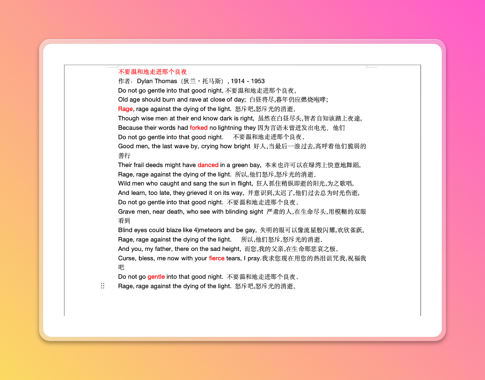
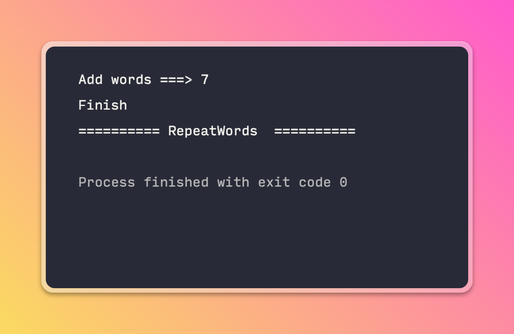
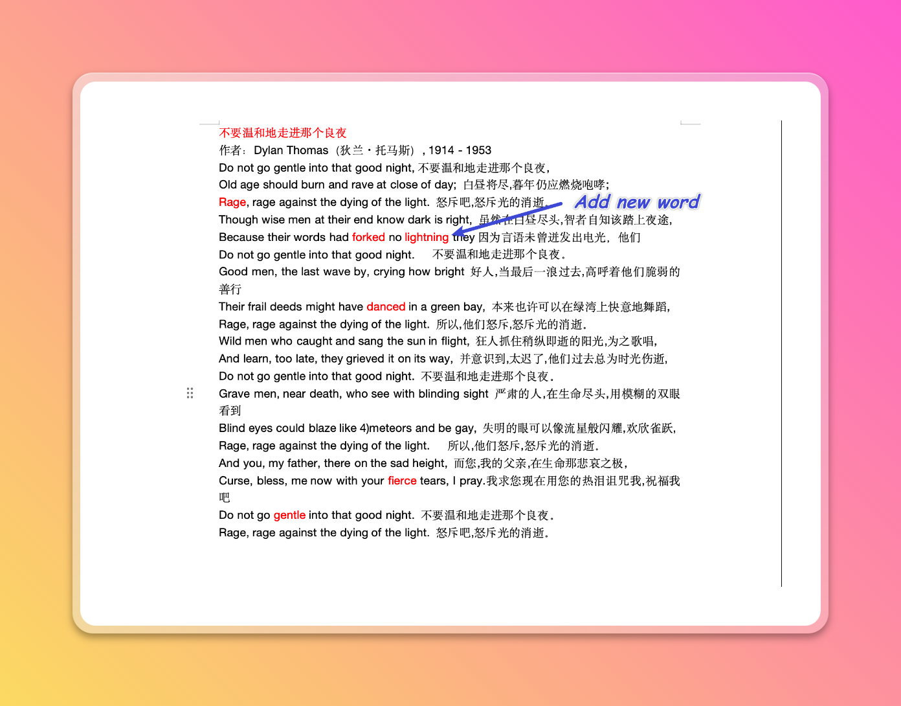
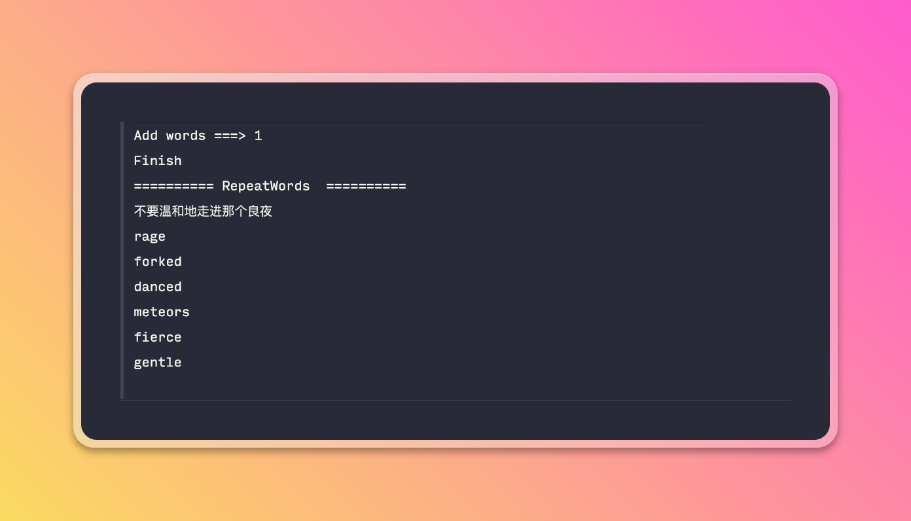

### Thoughts

I copy the articles into ``xxx.docx`` when I study English and mark the words I don't know. Extract the words into the ``xxx.txt`` file and recite them with the "No Memorized Words App".  

**Currently this program will help me to extract the marked words**

### Uus

1. Specify the target file path

2. Specify the output path

- Execution of the program

- Modify the example file to add new words

- Execute the procedure again

- Output repeat word

### TODO

- [ ] format RGB vlaue

### 🦄

- If you have good ideas welcome to discuss😇
- [post](https://agility6.site/blog/auto-word-java/)
