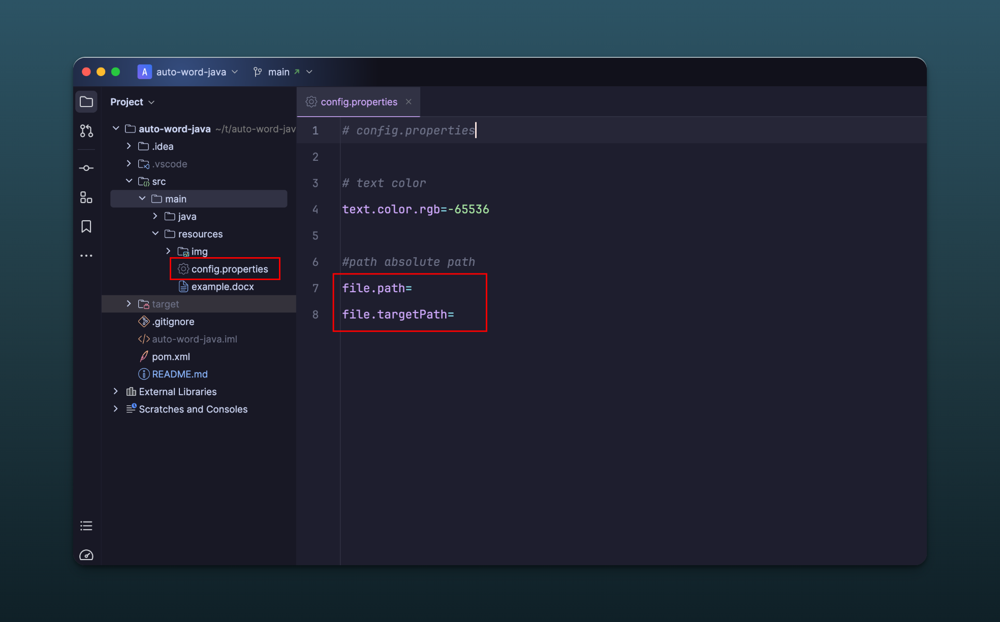

### Use 

1. Add the target document path to `file.path` in `config.properties`, and remember to add `.docx` at the end. 

2. Add `.txt` output path to `file.targetPath`.

###  

### 🦄

- If you have good ideas welcome to discuss😇
